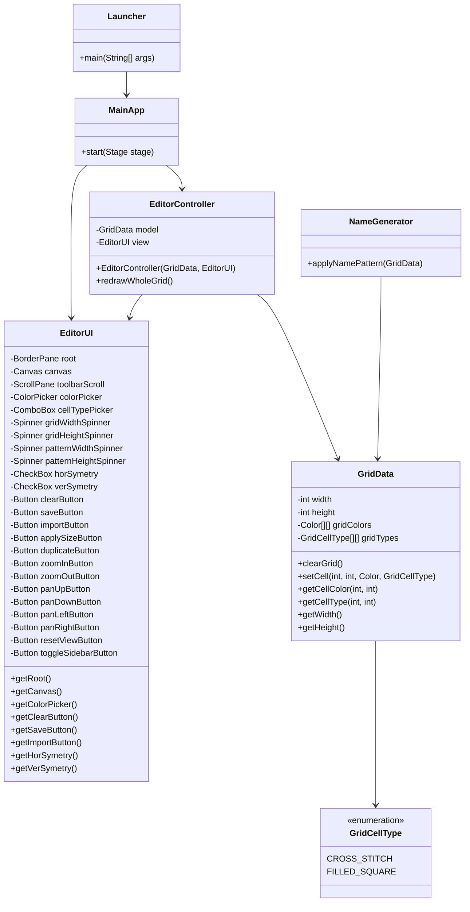

# Титульна сторінка

**Міністерство освіти і науки України**  
**Національний університет "Києво-Могилянська академія"**  
**Факультет інформатики**     
**Дисципліна: "Практика Навчальна"**    
**Проєкт: "Cтворення схем української вишивки засобами Java"**   

## ЗВІТ

**Ващук Микола**  
**Студент 1 курсу НаУКМА**  
**Факультет Інформатики**    
**Спеціальність:  
Інженерія програмного забезпечення, група 4**

**Київ - 2026**

---

# Зміст
1. Опис задачі  
2. Можливості програми  
3. Опис класів  
4. UML-діаграма  
5. Опис проблем і способів їх розв’язання  
6. Список комітів / код  
7. Висновок

---

# 1. Опис задачі
Потрібно було створити JavaFX-додаток для побудови та редагування вишиваних схем. Програма повинна дозволяти користувачу малювати на сітці, задавати колір нитки, вмикати симетрію, очищати поле, а також зберігати та імпортувати зображення у форматі PNG.

Додаткові вимоги:
- при запуску автоматично генерується схема вишивки імені;
- користувач може змінювати розміри сітки;
- є дублювання фрагмента орнаменту з опційною симетрією;
- є вибір типу стібка та кольору.

Проєкт реалізовано у вигляді MVC-архітектури:
- **Model** — зберігання даних сітки та типів клітинок;
- **View** — побудова графічного інтерфейсу;
- **Controller** — обробка подій користувача та логіка збереження/імпорту.

---

# 2. Можливості програми
Програма підтримує такі функції:

- малювання по клітинках на полотні `Canvas`;
- вибір кольору нитки через `ColorPicker`;
- вибір типу стібка через `ComboBox`;
- горизонтальна та вертикальна симетрія;
- зміна розміру сітки (W × H) через панель керування;
- дублювання фрагмента орнаменту з опційною симетрією;
- масштабування полотна (zoom in/out);
- панорама полотна (зсув вліво/вправо/вгору/вниз);
- скидання масштабу і позиції;
- прокрутка панелі інструментів;
- кнопка для приховування/показу панелі;
- очищення сітки;
- збереження поточної схеми у PNG;
- імпорт PNG-зображення назад у програму;
- відображення орнаменту імені на старті;
- підтримка двох типів клітинок:
  - `CROSS_STITCH`
  - `FILLED_SQUARE`.

---

# 3. Опис класів

## `Launcher`
Точка входу в програму. Запускає JavaFX-додаток через `Application.launch(...)`.

## `MainApp`
Головний клас JavaFX-застосунку.
- створює модель `GridData`;
- створює вигляд `EditorUI`;
- створює контролер `EditorController`;
- формує `Scene` і показує вікно.

## `EditorController`
Контролер, який зв’язує інтерфейс і модель.
Виконує такі функції:
- обробка кліків мишкою по полотну;
- малювання клітинок;
- підтримка симетрії;
- зміна розміру сітки;
- дублювання фрагмента орнаменту;
- масштабування та панорама полотна;
- приховування/показ панелі інструментів;
- очищення сітки;
- збереження схеми у PNG;
- імпорт PNG-файлу;
- перемальовування всієї сітки після змін.

## `EditorUI`
Клас представлення. Відповідає за побудову графічного інтерфейсу:
- ліву панель інструментів;
- `ScrollPane` для прокрутки панелі;
- `Canvas` для малювання;
- кнопки керування;
- `ColorPicker`;
- `ComboBox` для вибору типу стібка;
- `Spinner` для зміни розміру сітки;
- `Spinner` для розміру фрагмента;
- `Button` для дублювання фрагмента;
- `Button` для масштабування і панорами;
- `Button` для приховування/показу панелі;
- `CheckBox` для симетрії.

## `GridData`
Модель даних.
- зберігає кольори клітинок;
- зберігає тип клітинки;
- підтримує змінні розміри сітки (задаються користувачем);
- реалізує очищення та доступ до значень.

## `GridCellType`
Перелік типів клітинок:
- `CROSS_STITCH`;
- `FILLED_SQUARE`.

## `NameGenerator`
Клас для побудови стартового орнаменту імені.
- містить шаблон символів;
- переносить шаблон у модель;
- задає різні кольори та типи клітинок залежно від символу.

---

# 4. UML-діаграма
Нижче наведено спрощену UML-діаграму у форматі Mermaid:

---

# 5. Опис проблем і способів їх розв’язання

## 5.1. Відсутність `javac`
Спочатку в системі був встановлений лише runtime Java, але не JDK. Через це Maven не міг компілювати проєкт.

**Розв’язання:**
- встановлено пакет `java-25-openjdk-devel`;
- після цього з’явився компілятор `javac`;
- збірка через Maven стала успішною.

## 5.2. Неправильний модуль JavaFX
Для збереження PNG використовувався `SwingFXUtils`, а модуль JavaFX Swing був підключений некоректно.

**Розв’язання:**
- у `module-info.java` та `pom.xml` було приведено залежності до правильного стану;
- проєкт успішно компілюється.

## 5.3. Імпорт PNG відкривав не той діалог
Спочатку для імпорту використовувався діалог збереження замість діалогу відкриття.

**Розв’язання:**
- замінено `showSaveDialog(...)` на `showOpenDialog(...)`;
- додано фільтр PNG;
- перевірено, що файл читається коректно.

## 5.4. Невизначена стартова папка у `FileChooser`
Користувачу було складно знайти PNG-файли, бо діалог відкривався не в тій директорії.

**Розв’язання:**
- додано початкову директорію для `FileChooser`;
- діалог відкривається в папці проєкту, де лежить тестовий PNG.

## 5.5. Дрібні warning’и у коді
Було кілька попереджень про невикористані методи та змінні.

**Розв’язання:**
- прибрано зайві елементи;
- код став чистішим і зрозумілішим.

## 5.6. Перші труднощі з JavaFX
На початку було складно розібратися з JavaFX-компонентами, обробниками подій та побудовою UI.

**Розв’язання:**
- поступово розібрався з базовими контролами (Canvas, ColorPicker, Button, Spinner);
- розніс логіку за MVC (Model/View/Controller);
- поступово додав нові елементи й перевіряв роботу після кожної зміни.

## 5.7. Панель інструментів не вміщалася у вікно
Через збільшену кількість контролів частина кнопок не була доступна.

**Розв’язання:**
- додано `ScrollPane` для панелі інструментів;
- додано кнопку приховування/показу панелі.

---

# 6. Список комітів / код

## Останні коміти з репозиторію
`3826d17` — `feat: implement sidebar toggle, zoom, and pan functionality in EditorController and EditorUI`
`5734880` — `feat: add grid size adjustment and pattern duplication functionality in EditorController and EditorUI`
`66b93d8` — `feat: add cell type selection functionality in EditorUI and update drawing logic in EditorController`
`adb2bb1` — `feat: add save and import functionality for PNG files in EditorController && test everything`
`6ed096c` — `feat: implement 41x41 symmetry grid and precise Mykola embroidery pattern`
`f7d1333` — `feat: add canvas drag handling and clear grid functionality in EditorController`
`9b627d1` — `feat: implement canvas click handling and color selection in EditorUI`
`32b04c0` — `feat: enhance EditorUI with toolbar, canvas, and grid drawing functionality`
`2a5277e` — `feat: implement initial MVC structure with GridData model, EditorUI view, and EditorController`
`21ce9fd` — `init: setup JavaFX project and basic MVC structure`

## Що було реалізовано у коді
- стартова JavaFX-структура проєкту;
- MVC-архітектура;
- полотно для малювання;
- підтримка кольору та симетрії;
- типи стібка (CROSS_STITCH / FILLED_SQUARE);
- зміна розміру сітки;
- дублювання фрагмента орнаменту;
- масштабування і панорама полотна;
- приховування/показ панелі інструментів;
- генерація орнаменту імені;
- експорт PNG;
- імпорт PNG;
- очищення сітки.

---

# 7. Висновок
У результаті було створено повноцінний JavaFX-редактор вишиваних схем із графічним інтерфейсом, підтримкою симетрії, збереженням у PNG та імпортом зображень. Проєкт організовано за принципом MVC, що робить код зрозумілим і зручним для подальшого розвитку.
